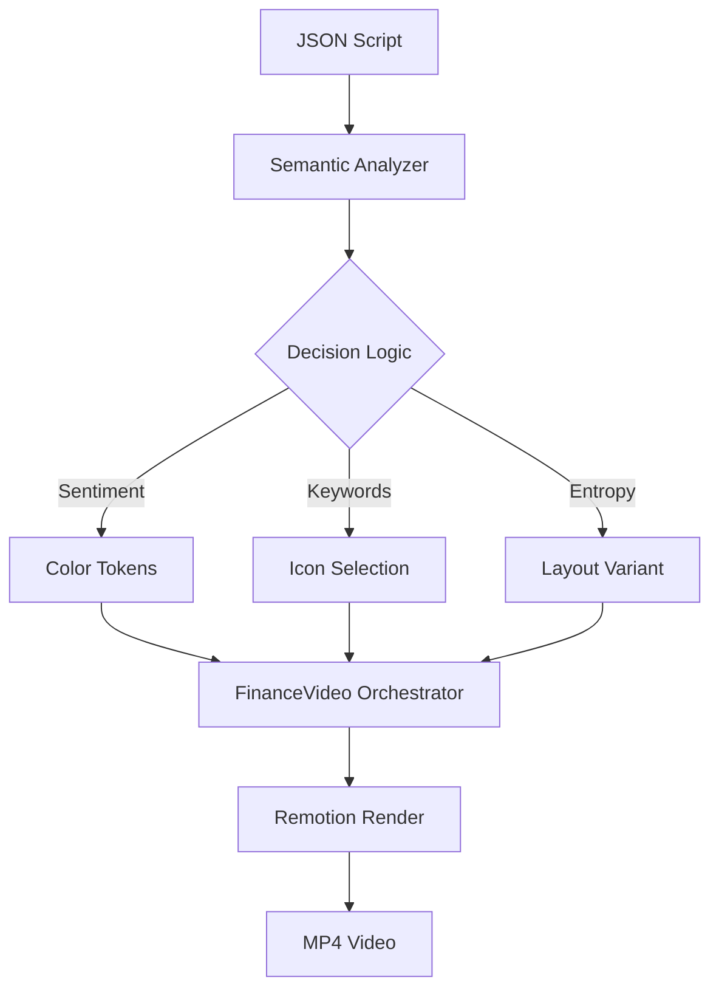

# 🌙 Noctis: Adaptive Finance Video Engine

Noctis is a high-performance, **Generative Video Engine** built on [Remotion](https://www.remotion.dev/). It transforms raw financial scripts into premium, data-driven motion graphics for social media (Instagram Reels, TikTok, YouTube Shorts) automatically.


---

## 🚀 The Core Innovation: "One Script, Infinite Visuals"

Unlike traditional video templates, Noctis doesn't use fixed assets. It **understands** your script and builds the video in real-time.

### 🧠 Semantic Intelligence Engine
- **Auto-Illustrator:** Scans text for keywords (e.g., "bank", "wealth", "crypto") and automatically mounts the relevant 3D-styled holographic icons.
- **Sentiment-Driven Themes:** Instantly shifts color palettes based on market tone:
  - 🟢 **Bullish:** Energetic Emerald Greens for surges and profit.
  - 🔴 **Bearish:** Cautionary Crimson Reds for crashes and fear.
  - 🔵 **Neutral:** Midnight Cyans for insights and data.

### 📈 Generative Data Viz
- **Live Path Evolution:** Uses `@remotion/paths` to physically draw SVG charts based on your raw data points.
- **Dynamic Risk Curves:** The graphs aren't images—they are functional React components that react to script context.

### 🎨 Structural Randomization
- No two videos look identical. The engine randomly selects between **Centered**, **Split-Screen**, and **Bottom-Weighted** layouts for every scene, ensuring your content always feels fresh.

---

## 🛠️ Architecture Overview



---

## 🏁 Getting Started

### Prerequisites
- Node.js (v18+)
- FFmpeg (for rendering)

### Installation
```bash
# Clone the repository
git clone https://github.com/satwiksharma01/motion-graphic-video-generator.git

# Install dependencies
npm install
```

### Rendering a Video
1. Define your script in the `scripts/` directory as a JSON file.
2. Run the batch-render command:
```bash
node scripts/parse-and-render.mjs
```

### Local Development (Studio)
```bash
npm run dev
```

---

## 📂 Project Structure
- `/src/lib/analyzer.ts` - The Semantic Engine (Sentiment & Keyword mapping).
- `/src/scenes/` - Modular, data-reactive scene components.
- `/scripts/` - JSON configuration for individual videos.
- `/src/FinanceVideo.tsx` - The main composition orchestrator.

---

## 📜 License
This project is for demonstration purposes. Use it to revolutionize your financial storytelling.

---
Built with ❤️ by the Noctis Team.
